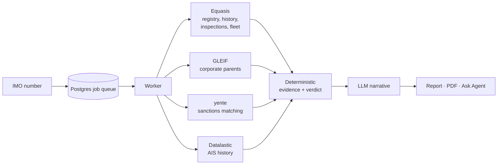

# Talasa

> **A note from the author**
>
> Hi everyone! I spent two months building this platform. I did research,
> interviewed seafarers and former legal ops and compliance professionals, and
> dug into the maritime domain, and what grew out of that is what you see in
> this repository. The main working module is **vessel screening**.
>
> We tried to find our first pilot users and wrote everywhere: email, Reddit,
> Telegram. We never got a single lead, so I decided to open-source the project
> in the hope that it will be useful to someone.
>
> If you have questions or suggestions, write to me at
> [ko1ebayev.worx@gmail.com](mailto:ko1ebayev.worx@gmail.com).

**Open-source maritime risk intelligence.** Screen vessels and shipping
companies for sanctions exposure, hidden ownership and dark-fleet behaviour.
Every verdict comes with the evidence behind it.

[](LICENSE)


Enter an IMO number and Talasa builds a risk report. It pulls registry and
inspection data, maps owners, managers and sister vessels, screens that whole
network against sanctions lists, and analyses 90 days of AIS positions. The
result is a **PROCEED / CAUTION / BLOCK** verdict from transparent, rule-based
scoring, plus an LLM-written summary that explains the evidence but cannot
change the verdict.

Everything runs locally: Postgres and the OpenSanctions matcher run in Docker,
and the apps run on your machine.

## Features

- **Vessel screening:**
  - identity, flag and name history
  - port state control record
  - owners and managers with GLEIF corporate parents
  - sister fleet
  - sanctions matches, split into direct designation, sanction-linked, PEP and
    POI
  - AIS behaviour
  - an interactive entity graph
  - PDF export
- **Counterparty due diligence:** screen a shipping company across its fleet,
  the companies it shares vessels with, and its parents. Verdict **CLEAR /
  ENHANCED_DD / REJECT**.
- **AIS behaviour detection:** transmission gaps, suspected ship-to-ship
  transfers and implausible speeds, weighted up inside known high-risk STS
  areas.
- **Satellite verification:** check a suspected STS transfer against Sentinel-1
  radar imagery for a second hull alongside.
- **Batches and monitoring:** screen a spreadsheet of vessels, and re-screen
  vessels on a schedule with change detection and escalations.
- **Ask Agent:** a chat assistant on every report that answers from the
  report's own data and can search the web, citing sources.
- **Local sanctions data:** runs against a self-hosted
  [yente](https://github.com/opensanctions/yente), so no sanctions API key is
  needed.

## How it works



The API queues work in Postgres, and a worker runs the pipeline stage by stage. If a source is unavailable, the report records a data gap
instead of failing silently.

The verdict is computed by code from published weights (see
[docs/scoring.md](docs/scoring.md)). The LLM only writes the narrative.

## Quick start

**Prerequisites:**
- Node.js 22+ and pnpm 10 (`corepack enable`)
- Docker with Compose
- for local sanctions data, about 8 GB of free RAM and 30 GB of disk

```bash
git clone https://github.com/0xka13b/talasa.git && cd talasa
pnpm install
cp .env.example .env     # set BETTER_AUTH_SECRET: openssl rand -base64 32
pnpm db:setup            # start Postgres, run migrations, seed an account
pnpm dev                 # start every app in watch mode
```

Open <http://localhost:3001> and sign in with **`admin@talasa.sh`** /
**`qwerty12345`**. The seeded account comes with three finished example
screenings, so you can explore full reports before configuring any data
source.

**Sanctions screening.** Start the local OpenSanctions matcher:

```bash
pnpm yente:up      # Elasticsearch + yente on http://localhost:8000
pnpm yente:logs    # first start downloads (~2.6 GB) and indexes the data
```

The first index takes about 15–30 minutes, and later starts reuse it. By
default yente loads the public OpenSanctions dataset, which is free for
**non-commercial use only**. See [Data sources](docs/data-sources.md) for
commercial use or the hosted API.

**New screenings.** To run your own screenings, add to `.env`:
- an LLM endpoint (`INFERENCE_*`, OpenRouter by default)
- a free [Equasis](https://www.equasis.org) account (`EQUASIS_*`)

AIS (Datalastic), maps and geocoding (Google), satellite checks (Copernicus)
and web search (Exa) are optional. Without their keys, those parts are shown as
unavailable. [Configuration](docs/configuration.md) lists every variable.

| Service | URL |
|---|---|
| Platform | <http://localhost:3001> |
| API | <http://localhost:8787> |
| Adminer (database UI) | <http://localhost:8080> |
| yente | <http://localhost:8000> |

## Documentation

- [Product overview](docs/product.md): what it does, feature status, glossary
- [Architecture](docs/architecture.md): processes, job queue, data model, API
- [Vessel screening](docs/vessel-screening.md): the pipeline stage by stage
- [Risk scoring](docs/scoring.md): every weight and threshold
- [AIS and satellite verification](docs/ais-and-satellite.md)
- [Counterparty due diligence](docs/counterparty-due-diligence.md)
- [Batches and monitoring](docs/monitoring-and-batches.md)
- [Ask Agent](docs/ask-agent.md)
- [Data sources](docs/data-sources.md): providers, terms of use, rate limits
- [Configuration](docs/configuration.md): all environment variables

## Project structure

```
apps/
  platform/     analyst web app (TanStack Start, React)
  api/          HTTP API, auth, Ask Agent (Hono, better-auth, AI SDK)
  jobs/         worker: pipelines and monitor scheduler
  landing/      marketing site (optional)
  blog/         Astro blog (optional)
packages/
  shared/       schemas, scoring models, AIS detectors, batch parsing
  db/           Drizzle schema, migrations, seed
  inference/    LLM client for structured report writing
  equasis/  opensanctions/  gleif/  datalastic/  copernicus/  gdelt/
                typed clients for each data source
docker-compose.yml        Postgres + Adminer
docker-compose.yente.yml  Elasticsearch + yente
```

## Development

```bash
pnpm dev            # all apps
pnpm check-types    # typecheck every package
pnpm lint
pnpm test           # Vitest; some api/jobs suites use the DATABASE_URL database
pnpm db:reset       # wipe and recreate the local database (then db:migrate, db:seed)
```

Port 5432 or 8080 already in use? Set `POSTGRES_PORT`, `ADMINER_PORT` and
`DATABASE_URL` in `.env`.

## Contributing

Issues and pull requests are welcome.

- **Before opening a PR:** run `pnpm check-types` and `pnpm test`.
- **Scoring changes:** update [docs/scoring.md](docs/scoring.md) in the same PR.
  Every weight should stay documented.
- **New data sources:** follow the existing client packages. See
  [Data sources](docs/data-sources.md#adding-a-source).
- **Licence:** contributions are licensed under AGPL-3.0.

## Disclaimer

Talasa is a decision-support tool, not legal or compliance advice. Sanctions
matches, AIS patterns and inferred ownership must be reviewed by a qualified
person before acting on them. Data from third-party providers is subject to
their own licences and terms of use, which you are responsible for following.

## License

[GNU Affero General Public License v3.0](LICENSE). If you run a modified version
of Talasa as a network service, you must make your source code available to its
users.
