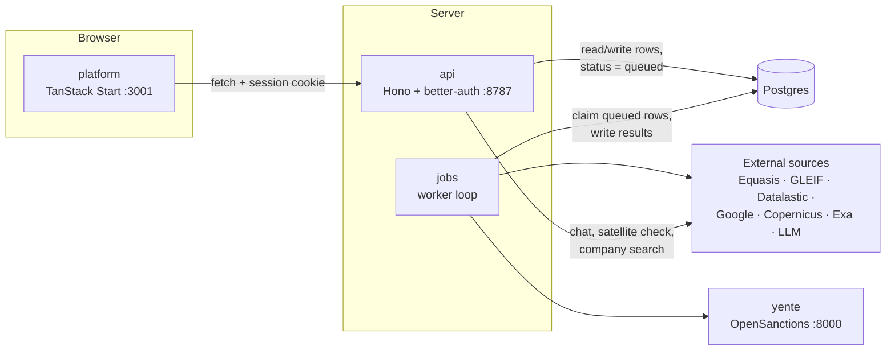

# Architecture

Talasa is a pnpm + Turborepo monorepo in TypeScript. Three processes share one
Postgres database. There is no message broker: the database is the job queue.

## Processes

| App | Role |
|---|---|
| `apps/platform` | The analyst web app. A browser client of the API; progress is shown by polling. |
| `apps/api` | HTTP API and authentication. Stores records, queues work, serves the chat agent, runs on-demand satellite checks and Equasis company searches. |
| `apps/jobs` | The worker. Runs the pipelines and the monitor scheduler. |
| `apps/landing`, `apps/blog` | Marketing site and blog. Independent of the rest; they never call the API. |

## Job queue

The API never calls the worker directly:
- To start work it sets a screening's or project's `status` to `queued`.
- Batches insert their screenings already queued.
- Monitors get queued work from the scheduler.

The worker (`apps/jobs/src/worker.ts`) loops:

1. Run the monitor scheduler, which queues screenings for any monitor that is
   due.
2. Claim one queued DD project and run it.
3. Claim one queued vessel screening and run it.
4. If nothing was found, sleep `WORKER_POLL_MS` (default 2 s).

Claiming is a single
`UPDATE … WHERE status = 'queued' … FOR UPDATE SKIP LOCKED`, so several worker
processes can run side by side safely.

**Per-stage handling:**
- **Recording:** each stage result goes into the row's `steps` JSON as it
  finishes, together with a `progress` counter that the UI polls.
- **Retries:** a stage is retried three times with backoff.
- **Failures:** critical-stage failures mark the row `failed`; best-effort
  failures become data gaps.

**Leases.** A row stuck in `running` for longer than `WORKER_LEASE_MINUTES` can
be claimed again, and the new run skips stages that already finished. Leases
have no heartbeat, so with more than one worker process, set the lease above
your longest run. Equasis-heavy screenings can take 30 minutes or more;
`.env.example` uses 45.

## Data model

Tables are defined with Drizzle in `packages/db/src/schema/`.

| Table | Holds |
|---|---|
| `user`, `session`, `account`, `verification` | better-auth accounts and sessions |
| `screenings` | Vessel screenings: IMO, status, per-stage `steps`, `brief` (the report), `graph`, saved graph-board layout, monitor snapshot |
| `projects` | Counterparty DD cases: intake fields, status, `steps`, `resolved` entity, `brief` |
| `batches` | A named set of screenings from one upload |
| `monitors`, `monitor_runs`, `monitor_changes` | Monitor rules, their scheduled runs, and the changes each run found |
| `sar_verifications` | Cached Sentinel satellite checks (image chip and result) |
| `chats`, `messages` | Ask Agent conversations, one chat per screening or project |

Screenings, projects, batches, monitors and chats belong to the user who
created them (`created_by`), and deleting a user deletes their records.

**Migrations** are SQL files in `packages/db/drizzle/`, generated from the
schema:
- `pnpm --filter @talasa/db db:generate` creates a new migration.
- `pnpm db:migrate` applies pending migrations.

## API

All routes except `/health` and `/api/auth/*` need a session.

| Route | Purpose |
|---|---|
| `/api/auth/*` | better-auth: sign in, sign out, session |
| `/api/screenings` | Vessel screenings: create, run, list, get, archive, delete, save graph layout, satellite check (`POST /:id/sts/:idx/sar`) |
| `/api/projects` | DD cases: create, run, list, get, update, delete |
| `/api/batches` | Create (queues all members), list, get, archive, delete |
| `/api/monitors` | Monitors, their runs and changes; trigger, acknowledge, archive |
| `/api/equasis` | Live Equasis lookups: `GET /ship/:imo`, `GET /company?name=` |
| `/api/chats` | Ask Agent chats and `POST /:id/stream` |
| `/health` | Liveness |

**Access control.** Access is per user: every query is filtered to records the
signed-in user created. There are no roles, organisations or sharing.

**Accounts.**
- `pnpm db:seed` creates the local `admin@talasa.sh` account.
- The platform has no sign-up page (`/register` redirects to `/login`).
- The better-auth sign-up endpoint is still enabled, so accounts can also be
  created through `POST /api/auth/sign-up/email`.

## Packages

| Package | What |
|---|---|
| `shared` | Zod schemas and types shared by all apps, both scoring models, AIS detectors, batch parsing, monitor diffing |
| `db` | Drizzle schema, client, migrations, seed |
| `inference` | Small OpenAI-compatible client for the structured report-writing calls, with an optional fallback provider |
| `equasis`, `opensanctions`, `gleif`, `datalastic`, `copernicus`, `gdelt` | Typed clients for each data source (see [data-sources.md](data-sources.md)) |
| `typescript-config`, `eslint-config` | Shared tooling config |

## Security notes

Talasa is set up to run on your own machine. If you expose it on a network:

- **CORS:** the API accepts any `localhost` origin, as well as `CORS_ORIGIN`,
  in every environment.
- **Seed account:** its password is public, so don't run the seed on a shared
  database.
- **No rate limiting:** the API has no rate limits.
- **Production check:** with `NODE_ENV=production`, the API refuses to start if
  `CORS_ORIGIN` or `BETTER_AUTH_URL` point at localhost, or if the auth URL
  isn't HTTPS.
- **Same site:** cookies use better-auth defaults (`SameSite=Lax`), so the
  platform and API must be served from the same site.

## Tests

`pnpm test` runs Vitest in every package:
- The data-source clients test against fixtures and stubbed `fetch`.
- The platform uses jsdom and Testing Library.
- Some `api` and `jobs` suites are integration tests against the database in
  `DATABASE_URL`. They insert their own rows, so point them at a development
  database.
